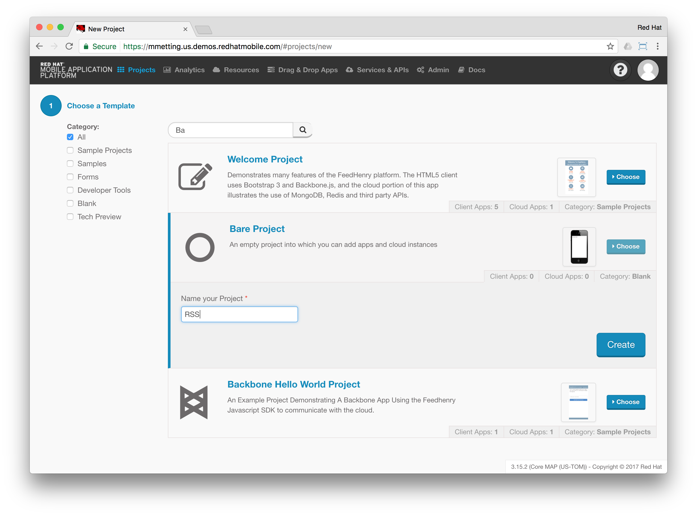
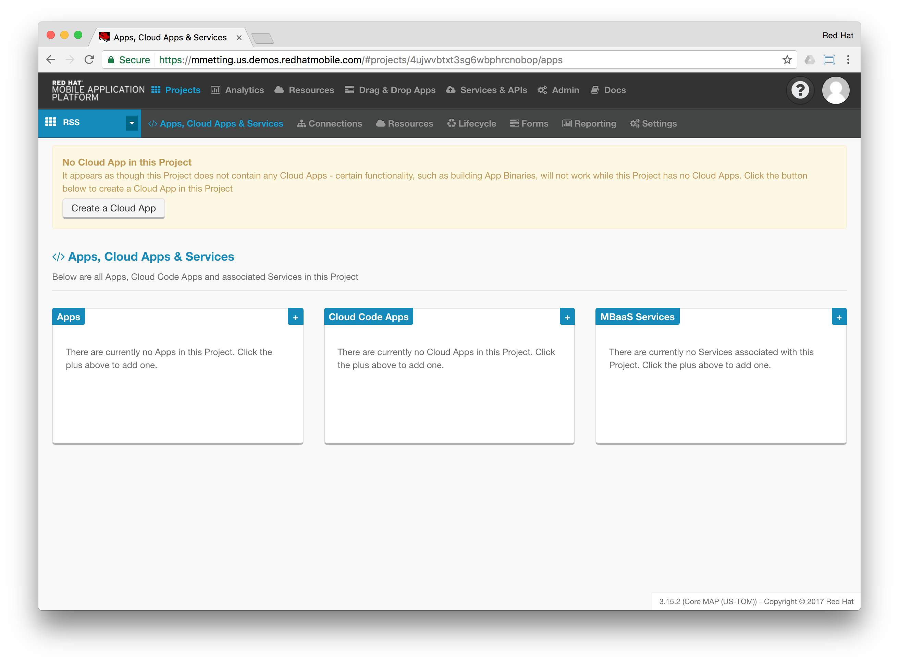
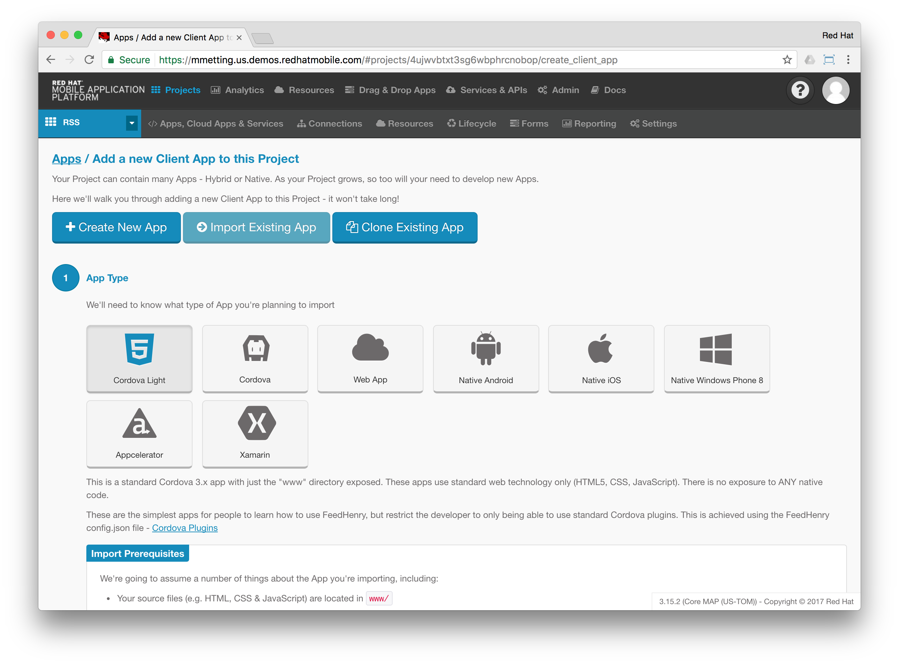
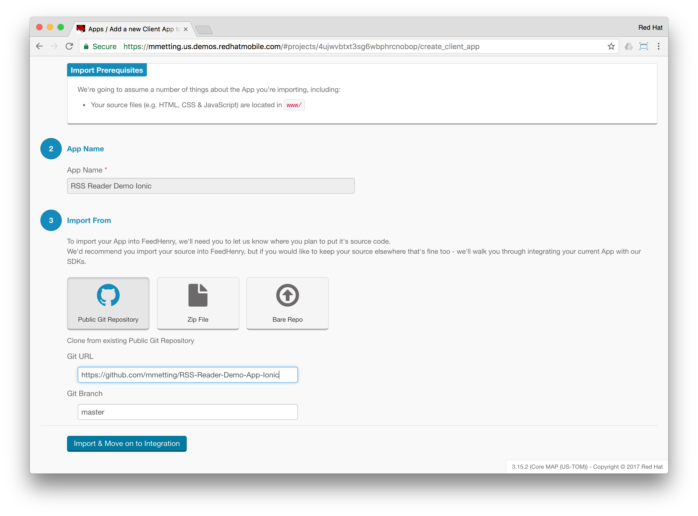
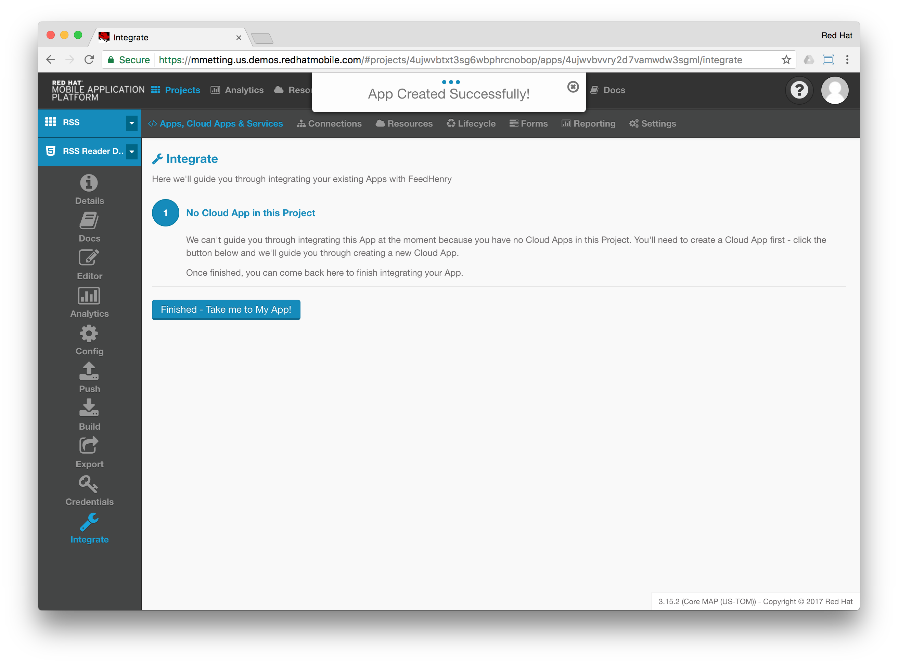
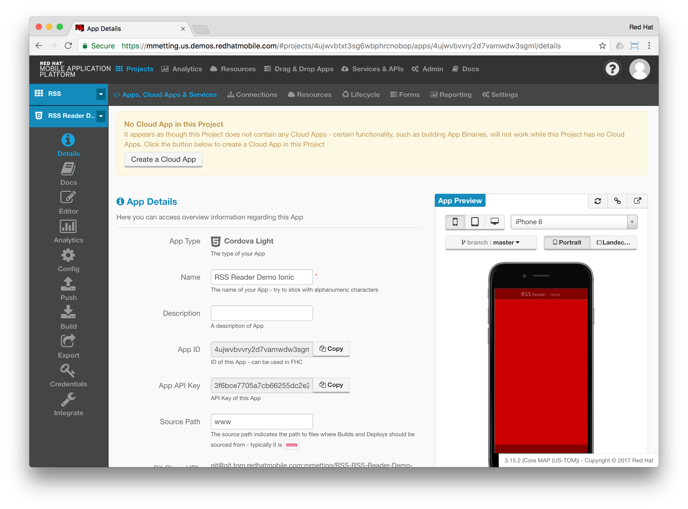

# RSS Reader Demo App
## Based on Ionic
This demo app is a basic RSS Reader retrieving RSS feeds from the Red Hat Mobile Platform.

### views/example.html
The view of the app is defined by `views/example.html`.

It consists of the following elements:
- Header
- Content
- Footer

Within the content section, the view's controller `MainCtrl` is referenced, which will populate the `$scope` variable with RSS feeds.

### app/controller.js
All controller logic is implemented in `app/controllers.js`. On instantiation, a request will be triggered against the app's corresponding 
server side (the Cloud Application). 

The response will be used to populate the RSS feeds in the scope of the controller. 

## Import / Installation on a RHMAP domain

### Create a new porject

> You can skip the creation of a new project, if you want to import the client into an exisiting project.

- Open your domain
- Click on `Projects` --> `+ New Project`
- Start typing in the search bar `Bare Project`
- Click `Choose` and specify a name for the project: `RSS`

- Click `Create` and `Finish` after the wizard has completed
- This will open your project in RHMAP:

### Import an exisiting app

- Click the little plus sign in the apps' section
- Select `Import Existing App`
- Choose `Cordova Light`

- Click `Next`
- Give the app a name: `RSS Reader Demo Ionic`
- Click `Next`
- Select `Public Git Repository`
- Insert the following Git Repo URL: `https://github.com/mmetting/RSS-Reader-Demo-App-Ionic`
- Make sure, `master` is specified

- Click the button for `Import & Move on to Integration`

- Click `Finished - Take me My App`

Since the client requests RSS feeds from it's corresponding server-side API, we would need to create a Cloud App in this project:

Continue with the import of the prepared [Cloud App](https://github.com/mmetting/RHMAP-RSS-Reader-Demo-Cloud-App).

### Configure the Ionic app

> After adding the Cloud App and it's dependencies to your domain, you would need to change the fhconfig.json to reflect your domain / project.

- Go to the Editor - Tab of the imported Ionic app and open the file `www/fhconfig.json``
- Change the following values to reflect your domain:
    - appid - can be found on the app's Details tab
    - appkey - can be found on the app's Details tab
    - host - the URL to your domain
    - projectid - click on the `Settings` menu item of your project